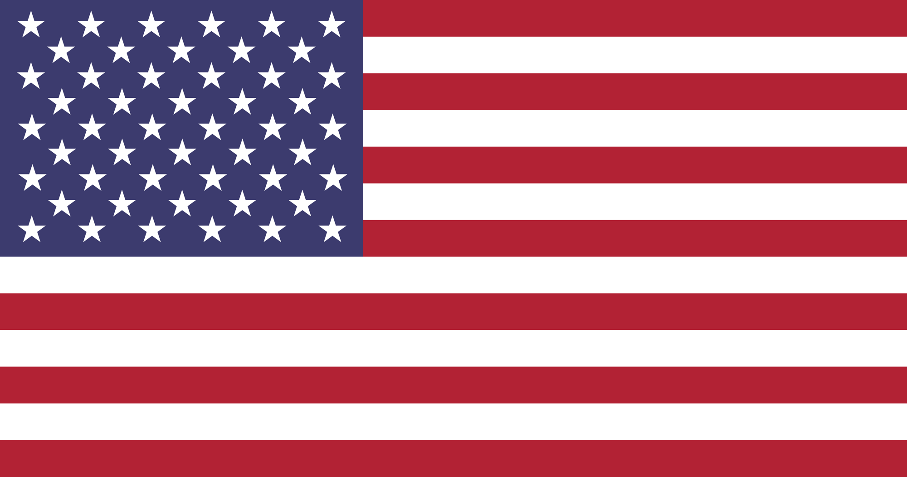
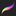

#### _Leia isso em outras linguaguens_
<kbd>[](NamassaUtils/Translations/READMEen.md)</kbd>


 


# Namassa App

Namassa é um protótipo de aplicativo IOS desenvolvido por estudantes do Instituto Federal de Educação, Ciência e Tecnologia durante a turma Foundation do Apple Developer Academy.
O app se baseia na premissa de oferecer uma maneira prática de encontrar receitas com base na disponibilidade de ingredientes do usuário. Para tal, um mecanismo de busca por filtragem é disponibilizado, permitindo a busca de receitas condicionadas às escolhas o usuário.
# Funcionalidades

## Tela de busca inteligente

Nessa tela, o usuário informa os ingredientes que possui e, ao pressionar o botão de pesquisa, realiza a busca de receitas que contenham tais ingredientes 

## Tela de favoritos

Nessa tela, as receitas favoritadas pelo usuário são exibidas

# Atalhos para nosso Github 🎯
- [Models](Namassa/Models)  
- [Views](Namassa/Views)  
- [Images](NamassaUtils)

# Integrantes 🌐
<div align="center">
<table>
  <tbody>
    <tr>
      <td align="center"><a href="https://github.com/brwndag"><br /><sub><b>Brenda Mônica</b>
        </a>
        <p><sub>Designer</sub></p></sub></td>
      <td align="center"><a href="https://github.com/IsaacMaf"><br /><sub><b>Isaac Ramos</b></a>
        <p><sub>Desginer</sub></p></sub></td>
      <td align="center"><a href="https://github.com/LeviFaleh"><br /><sub><b>Levi Faleh</b></a>
        <p><sub>Developer</sub></p></sub></td>
      <td align="center"><a href="https://github.com/VorAd2"><br /><sub><b>Vitor Adriano</b></sub></a>
        <p><sub>Developer</sub></p></td>
    </tr>
  </tbody>
</table>
</div>

## Ferramentas usadas
|    |  |    |
|----|-------------------------|----|
|  Google         |  Xcode |  ChatGPT |
|  Github           |  SkecthBook |  Procreate |
|  Figma            |  YouTube |  WhatsApp |


 
# Ferramentas usadas
        
      
  


  
```Swift
print("sit amet, consectetur adipiscing elit.")
```
```bash
Lorem ipsum dolor sit amet
```
- lorem 1
- lorem 2
- lorem 3
```bash
logo do Namassa:
```


|    | Ferramentas Utilizadas: |    |
|----|-------------------------|----|
|  Google         |  Xcode |  ChatGPT |
|  Github           |  SkecthBook |  Procreate |
|  Figma            |  YouTube |  WhatsApp |

### teste de badge


